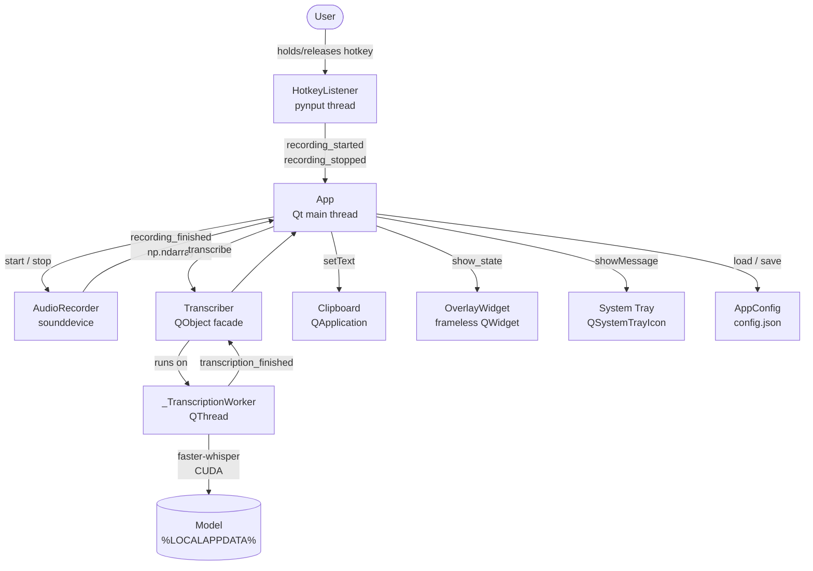

# spkup — Architecture

> Source of truth for component responsibilities, module boundaries, and the signal flow that connects them.

---

## 1. Overview

spkup is a single-process Windows desktop application. There is no server, no database, no network API, and no web frontend. Everything runs locally on the user's machine.

- **Runtime:** Python 3.12, single process
- **GUI framework:** PyQt6 — tray icon, overlay widget, settings dialog, clipboard
- **Inference:** faster-whisper (CTranslate2, CUDA) — runs on a QThread worker
- **Audio:** sounddevice (PortAudio) — 16 kHz mono float32, stays in memory as numpy arrays
- **Hotkey:** pynput — background thread, marshalled to Qt main thread via QMetaObject
- **Persistence:** JSON config file at `%APPDATA%/spkup/config.json`; model cache at `%LOCALAPPDATA%/spkup/models`
- **Logging:** rotating file log at `%LOCALAPPDATA%/spkup/spkup.log`

---

## 2. Component Diagram



---

## 3. Module Responsibilities

| Module | Class / Function | Responsibility |
| --- | --- | --- |
| `config.py` | `AppConfig` | Settings dataclass; JSON load/save with atomic write |
| `hotkey.py` | `HotkeyListener` | pynput keyboard listener; emits `recording_started` / `recording_stopped` on Qt main thread |
| `recorder.py` | `AudioRecorder` | sounddevice stream; accumulates float32 chunks; emits `recording_finished(np.ndarray)` |
| `transcriber.py` | `Transcriber` | Facade; owns `_TranscriptionWorker` lifecycle; busy guard; emits `transcription_finished(str)` |
| `transcriber.py` | `_TranscriptionWorker` | QThread worker; lazy model load; faster-whisper inference; emits result or error |
| `model_manager.py` | `ModelManager` | Cache dir management; `is_downloaded`; `_ModelDownloadWorker` for HuggingFace downloads |
| `overlay.py` | `OverlayWidget` | Frameless always-on-top click-through widget; RECORDING / TRANSCRIBING / DONE states |
| `clipboard.py` | `copy_to_clipboard` | `QApplication.clipboard().setText()` — Unicode-safe |
| `app.py` | `App` | `QApplication` + `QSystemTrayIcon`; instantiates all components; wires all signals |
| `settings_dialog.py` | `SettingsDialog` | Hotkey capture, model picker, device selector, overlay position; reinitializes components on save |
| `autostart.py` | functions | `winreg` HKCU Run key management |
| `logging_setup.py` | `configure_logging` | Rotating file handler + stderr handler |
| `__main__.py` | `main` | Entry point: configure logging, create `App`, call `run()` |

---

## 4. Signal Flow

```
Hotkey held
  → HotkeyListener.recording_started
    → AudioRecorder.start()
    → OverlayWidget.show_state(RECORDING)

Hotkey released
  → HotkeyListener.recording_stopped
    → AudioRecorder.stop()
    → OverlayWidget.show_state(TRANSCRIBING)

AudioRecorder.recording_finished(audio: np.ndarray)
  → Transcriber.transcribe(audio)

Transcriber.transcription_finished(text: str)
  → copy_to_clipboard(text)
  → OverlayWidget.show_state(DONE)         # auto-hides after 1.5 s
  → QSystemTrayIcon.showMessage(preview)

Transcriber.transcription_error(msg: str)  # or AudioRecorder.recording_error
  → OverlayWidget.show_state(HIDDEN)
  → QSystemTrayIcon.showMessage(error msg)
```

---

## 5. Threading Model

| Thread | What runs there | Communication |
| --- | --- | --- |
| Qt main thread | `App`, `OverlayWidget`, `AudioRecorder` callbacks, all signal slots | — |
| pynput listener thread | `HotkeyListener._on_press` / `_on_release` | `QMetaObject.invokeMethod` with `QueuedConnection` → main thread |
| `_TranscriptionWorker` (QThread) | faster-whisper inference | `pyqtSignal` → main thread |
| `_ModelDownloadWorker` (QThread) | HuggingFace model download | `pyqtSignal` → main thread |

**Rule:** No `QWidget` or `QApplication` method is ever called from a non-Qt thread.

---

## 6. Configuration

`AppConfig` fields and defaults:

| Field | Default | Notes |
| --- | --- | --- |
| `hotkey` | `"ctrl+shift+space"` | Parsed by `parse_hotkey()` in `hotkey.py` |
| `model_size` | `"large-v3"` | Any faster-whisper model name |
| `device` | `"cuda"` | `"cuda"` or `"cpu"` |
| `compute_type` | `"float16"` | `"float16"`, `"int8"`, or `"float32"` |
| `overlay_position` | `"bottom-right"` | `"bottom-right"`, `"bottom-left"`, `"top-right"`, `"top-left"` |
| `max_recording_seconds` | `120` | Safety cutoff for `AudioRecorder` |

---

## 7. Architectural Decisions

| Date | Decision | Rationale |
| --- | --- | --- |
| 2026-04-01 | Audio stays as numpy arrays, never written to disk | Simplicity; faster-whisper accepts arrays directly |
| 2026-04-01 | `language=None` for auto-detect | Best PT+EN code-switching support |
| 2026-04-01 | Lazy model load on first transcription | Avoid consuming VRAM at startup |
| 2026-04-01 | pynput over `keyboard` lib | Distinct press/release callbacks; no admin required |
| 2026-04-01 | QThread for transcription | Never block the UI thread during inference |
| 2026-04-01 | Atomic config write (temp file → rename) | Prevent corrupt config on crash during save |

---

## 8. Repository Layout

```text
e:\spkup\
  pyproject.toml
  requirements.txt
  run.bat
  src/spkup/
    __init__.py
    __main__.py
    app.py
    config.py
    hotkey.py
    recorder.py
    transcriber.py
    overlay.py
    clipboard.py
    model_manager.py
    settings_dialog.py
    autostart.py
    logging_setup.py
    resources/
      tray.png
  tests/
    test_config.py
    test_hotkey.py
    test_recorder.py
    test_model_manager.py
    test_clipboard.py
    test_autostart.py
  docs/
  specs/
```
