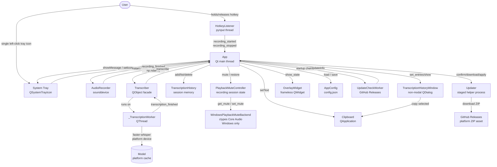

# spkup — Architecture

> Source of truth for component responsibilities, module boundaries, and the signal flow that connects them.

---

## 1. Overview

spkup is a single-process desktop application for Windows 11 x64 and Apple Silicon macOS. There is no server, no database, and no web frontend. Core transcription runs locally on the user's machine; the only runtime network path is the optional startup update check against GitHub Releases.

- **Runtime:** Python 3.12, single process
- **GUI framework:** PyQt6 — tray icon, overlay widget, settings dialog, clipboard
- **Inference:** faster-whisper (CTranslate2) — runs on a QThread worker; Windows defaults to CUDA, macOS defaults to CPU/int8
- **GPU runtime packaging:** Windows release bundles include NVIDIA CUDA/cuDNN wheel DLLs and fail packaging validation if critical DLLs are missing
- **Audio:** sounddevice (PortAudio) — 16 kHz mono float32, stays in memory as numpy arrays
- **Hotkey:** pynput — background thread, marshalled to Qt main thread via QMetaObject
- **Persistence:** platform paths from `platform_support.py`
  - Windows: `%APPDATA%/spkup/config.json`, `%LOCALAPPDATA%/spkup/models`, `%LOCALAPPDATA%/spkup/updates`
  - macOS: `~/Library/Application Support/spkup/config.json`, `~/Library/Caches/spkup/models`, `~/Library/Caches/spkup/updates`
- **Logging:** Windows writes `%LOCALAPPDATA%/spkup/spkup.log`; macOS writes `~/Library/Logs/spkup/spkup.log`

---

## 2. Component Diagram


```mermaid
flowchart TD
    User([User]) -- holds/releases hotkey --> HK[HotkeyListener\npynput thread]
    HK -- recording_started\nrecording_stopped --> App[App\nQt main thread]
  User -- single left-click tray icon --> TI[System Tray\nQSystemTrayIcon]
  TI -- activated Trigger --> App
    App -- start / stop --> REC[AudioRecorder\nsounddevice]
    REC -- recording_finished\nnp.ndarray --> App
    App -- transcribe --> TR[Transcriber\nQObject facade]
    TR -- runs on --> TW[_TranscriptionWorker\nQThread]
    TW -- faster-whisper\nplatform device --> ML[(Model\nplatform cache)]
    TW -- transcription_finished --> TR
    TR --> App
    App -- add/list/delete --> RH[TranscriptionHistory\nsession memory]
    App -- set_entries/show --> HW[TranscriptionHistoryWindow\nnon-modal QDialog]
    App -- mute / restore --> PM[PlaybackMuteController\nrecording session state]
    PM -- get_mute / set_mute --> PB[WindowsPlaybackMuteBackend\nctypes Core Audio\nWindows only]
    App -- setText --> CB[Clipboard\nQApplication]
    HW -- copy selected --> CB
    App -- show_state --> OV[OverlayWidget\nframeless QWidget]
    App -- showMessage / setIcon --> TI
    App -- load / save --> CFG[AppConfig\nconfig.json]
    App -- startup check --> UC[UpdateCheckWorker\nGitHub Releases]
    UC -- UpdateInfo --> App
    App -- confirm/download/apply --> UP[Updater\nstaged helper process]
    UP -- download ZIP --> GH[GitHub Releases\nplatform ZIP asset]
```

---

## 3. Module Responsibilities

| Module | Class / Function | Responsibility |
| --- | --- | --- |
| `config.py` | `AppConfig` | Settings dataclass; JSON load/save with atomic write |
| `platform_support.py` | functions | Platform tags, path selection, platform-specific defaults, and feature capability gates |
| `hotkey.py` | `HotkeyListener` | pynput keyboard listener; emits `recording_started` / `recording_stopped` on Qt main thread |
| `recorder.py` | `AudioRecorder` | sounddevice stream; accumulates float32 chunks; emits `recording_finished(np.ndarray)` |
| `transcriber.py` | `Transcriber` | Facade; owns `_TranscriptionWorker` lifecycle; busy guard; emits `transcription_finished(str)` |
| `transcriber.py` | `_TranscriptionWorker` | QThread worker; lazy model load; faster-whisper inference; emits result or error |
| `model_manager.py` | `ModelManager` | Cache dir management; `is_downloaded`; `_ModelDownloadWorker` for HuggingFace downloads |
| `overlay.py` | `OverlayWidget` | Frameless always-on-top click-through widget; RECORDING / TRANSCRIBING / DONE states plus remaining-time feedback during active capture |
| `clipboard.py` | `copy_to_clipboard` | `QApplication.clipboard().setText()` — Unicode-safe |
| `app.py` | `App` | `QApplication` + `QSystemTrayIcon`; instantiates all components; wires all signals; owns tray click recording toggle, trigger suppression, and the single `_cancel_active_transcription` entry point that discards an in-progress transcription (used today by the hotkey/tray start-trigger routing during the transcribing state, and reserved for a future overlay cancel button) |
| `settings_dialog.py` | `SettingsDialog` | Hotkey capture, model picker, device selector, overlay position, playback-mute toggle; reinitializes components on save |
| `transcription_history.py` | `TranscriptionHistory` | Session-scoped in-memory store of the last 5 completed transcriptions |
| `transcription_history.py` | `TranscriptionHistoryEntry` | Immutable history item with stable session-local id and text |
| `transcription_history_window.py` | `TranscriptionHistoryWindow` | Non-modal recent-history window; previews entries and emits copy/delete requests |
| `playback_mute.py` | `PlaybackMuteController` | Snapshots and restores the default playback mute state around a recording session |
| `playback_mute.py` | `WindowsPlaybackMuteBackend` | Windows-only Core Audio mute backend for the default playback endpoint via `ctypes` |
| `autostart.py` | functions | Windows-only `winreg` HKCU Run key management; unsupported platforms import safely and hide the UI control |
| `update_checker.py` | `UpdateCheckWorker`, `select_available_update` | Non-blocking GitHub Releases lookup; semantic version comparison; platform ZIP asset selection |
| `updater.py` | `UpdateDownloadWorker`, `launch_staged_update` | Downloads confirmed release ZIPs; automatic apply remains restricted to frozen Windows builds |
| `logging_setup.py` | `configure_logging` | Rotating file handler + stderr handler |
| `packaging_validation.py` | functions / CLI | Validates frozen PyInstaller bundles contain the CUDA/cuDNN DLLs required for GPU transcription before release upload |
| `__main__.py` | `main` | Entry point: repair missing standard streams in windowed builds, add bundled NVIDIA DLL directories to the Windows loader path, configure logging, create `App`, call `run()` |

---

## 4. Signal Flow

```
Hotkey held
  → HotkeyListener.recording_started
    → App-level trigger suppression check
    → if AppConfig.mute_playback_while_recording: play start cue, then PlaybackMuteController.mute_for_recording()
    → AudioRecorder.start()
    → OverlayWidget.show_state(RECORDING)
    → App updates OverlayWidget with the remaining recording time until the safety cutoff

Hotkey released
  → HotkeyListener.recording_stopped
    → App-level trigger suppression check (stop requests are always allowed while active)
    → AudioRecorder.stop()
    → PlaybackMuteController.restore()
    → OverlayWidget.show_state(TRANSCRIBING)

Tray left-click
  → QSystemTrayIcon.activated(Trigger)
    → App toggles recording through the same start / stop request helpers used by the hotkey

Recording stop / cancel / error / transcription finalize
  → App arms a 1.0 s start-trigger suppression window
    → redundant hotkey or tray start requests inside that window are ignored

AudioRecorder.recording_finished(audio: np.ndarray)
  → Transcriber.transcribe(audio)

Transcriber.transcription_finished(text: str)
  → copy_to_clipboard(text)
  → TranscriptionHistory.add(text)
  → TranscriptionHistoryWindow.set_entries(current list)
  → OverlayWidget.show_state(DONE)         # auto-hides after 1.5 s
  → QSystemTrayIcon.showMessage(preview)

Transcriber.transcription_error(msg: str)  # or AudioRecorder.recording_error
  → OverlayWidget.show_state(HIDDEN)
  → QSystemTrayIcon.showMessage(error msg)

AudioRecorder.recording_error(msg: str) or app shutdown during active capture
  → PlaybackMuteController.restore()

Tray action "Recent transcriptions"
  → App._show_transcription_history()
    → TranscriptionHistory.list_entries()
    → TranscriptionHistoryWindow.set_entries(entries)
    → TranscriptionHistoryWindow.show_window()

History window delete
  → delete_requested(entry_id)
    → TranscriptionHistory.delete(entry_id)
    → TranscriptionHistoryWindow.set_entries(updated list)

History window copy
  → QApplication.clipboard().setText(entry.text)
  → copy_requested(text)                   # logging/telemetry hook in App

Startup update check
  → if AppConfig.check_updates_on_startup
    → UpdateCheckWorker queries GitHub Releases on a QThread
    → if newer eligible release with matching platform ZIP exists
      → Windows frozen build asks the user before download/apply
      → UpdateDownloadWorker downloads the ZIP to platform update staging
      → Windows updater validates the archive and launches a helper PowerShell process
      → App quits; helper extracts the new bundle and starts updated spkup.exe
      → macOS detects the matching asset but leaves update apply manual
```

---

## 5. Threading Model

| Thread | What runs there | Communication |
| --- | --- | --- |
| Qt main thread | `App`, `OverlayWidget`, `AudioRecorder` callbacks, all signal slots | — |
| pynput listener thread | `HotkeyListener._on_press` / `_on_release` | `QMetaObject.invokeMethod` with `QueuedConnection` → main thread |
| `_TranscriptionWorker` (QThread) | faster-whisper inference | `pyqtSignal` → main thread |
| `_ModelDownloadWorker` (QThread) | HuggingFace model download | `pyqtSignal` → main thread |
| `UpdateCheckWorker` (QThread) | GitHub Releases metadata request | `pyqtSignal` → main thread |
| `UpdateDownloadWorker` (QThread) | Confirmed release ZIP download | `pyqtSignal` → main thread |
| updater helper process | Wait for frozen Windows app exit, extract release ZIP, start updated exe | Separate PowerShell process |

**Rule:** No `QWidget` or `QApplication` method is ever called from a non-Qt thread.

---

## 6. Configuration

`AppConfig` fields and defaults:

| Field | Default | Notes |
| --- | --- | --- |
| `hotkey` | `"ctrl+shift+space"` | Parsed by `parse_hotkey()` in `hotkey.py` |
| `model_size` | `"large-v3"` | Any faster-whisper model name |
| `device` | Windows: `"cuda"`; macOS: `"cpu"` | `"cuda"` or `"cpu"` |
| `compute_type` | `"int8"` | `"float16"`, `"int8"`, or `"float32"` |
| `overlay_position` | `"bottom-right"` | `"bottom-right"`, `"bottom-left"`, `"top-right"`, `"top-left"` |
| `max_recording_seconds` | `120` | Safety cutoff for `AudioRecorder`; also drives the live recording countdown shown in the overlay |
| `mute_playback_while_recording` | `False` | Windows-only; hidden/disabled on macOS |
| `check_updates_on_startup` | `True` | When enabled, startup checks GitHub Releases for a newer platform ZIP; Windows can auto-apply after confirmation, macOS is manual-update only |

---

## 7. Architectural Decisions

| Date | Decision | Rationale |
| --- | --- | --- |
| 2026-04-01 | Audio stays as numpy arrays, never written to disk | Simplicity; faster-whisper accepts arrays directly |
| 2026-04-01 | `language=None` for auto-detect | Best PT+EN code-switching support |
| 2026-04-01 | Lazy model load on first transcription | Avoid consuming VRAM at startup |
| 2026-04-01 | pynput over `keyboard` lib | Distinct press/release callbacks; no admin required |
| 2026-04-01 | QThread for transcription | Never block the UI thread during inference |
| 2026-04-01 | Atomic config write (temp file → rename) | Prevent corrupt config on crash during save |
| 2026-05-20 | Confirm-before-apply startup updates | Use the existing GitHub Releases ZIP channel without silent downloads or silent installs |
| 2026-05-27 | Add macOS ARM64 support without migrating Windows baseline | Platform abstractions preserve Windows paths, artifacts, CUDA validation, and auto-update apply while adding CPU-oriented Apple Silicon runtime and packaging |

---

## 8. Repository Layout

```text
e:\spkup\
  pyproject.toml
  requirements.txt
  run.bat
  spkup.spec
  spkup-macos.spec
  src/spkup/
    __init__.py
    __main__.py
    app.py
    config.py
    hotkey.py
    recorder.py
    transcriber.py
    overlay.py
    clipboard.py
    model_manager.py
    playback_mute.py
    settings_dialog.py
    transcription_history.py
    transcription_history_window.py
    autostart.py
    update_checker.py
    updater.py
    logging_setup.py
    platform_support.py
    resources/
      tray.png
  tests/
    test_config.py
    test_hotkey.py
    test_recorder.py
    test_model_manager.py
    test_clipboard.py
    test_app_playback_mute.py
    test_autostart.py
    test_playback_mute.py
    test_transcription_history.py
  docs/
  specs/
```
